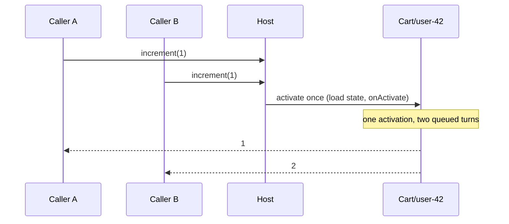

# The actor model

<p class="lede">An actor is `(type, key)`. The runtime finds it or creates it, runs one call at
a time against it, and puts it away when it goes quiet. You never construct one and you never
destroy one.</p>

## Identity

`actor(CartActor, 'user-42')` names a cart. It does not create one, look one up, or return a
handle you have to keep — it is an address, and it stays valid forever. Call it in one request
and again an hour later; the second call reaches the same logical object, whether or not
anything was in memory in between.

That is what *virtual* means: the actor always conceptually exists. What varies is whether it
is currently **activated**.

```ts
const cart = actor(CartActor, 'user-42');   // no I/O, no allocation on the server
await cart.addItem(item);                   // this is what activates it
```

The key is a string and it is part of your data model. It shows up in the storage record, the
cluster directory and — unless you configure otherwise — the routing token on the wire, so
prefer opaque ids over anything you would not want in a log. See
[Locality routing](/actors/docs/locality-routing).

## Activation

The first call to an inactive actor **activates** it: the runtime loads its state from
[storage](/actors/docs/storage), runs `migrateState` if the record predates this deploy,
builds the context, runs `onActivate`, and then runs your method.

Two calls racing to be first do not produce two activations. They join one:

```ts
const [a, b] = await Promise.all([client.increment(1), client.increment(1)]);
// [1, 2] — one activation, two turns, in some order
```

This is the single-activation invariant, and in a cluster it is what the actor directory
exists to preserve.



## Turns

A **turn** is one method call, and a turn ends when the method's promise *settles* — so an
awaited `fetch` inside a method keeps that actor busy for its whole duration. By default one
turn runs at a time, which is what makes `ctx.state.items.push(item)` safe with no lock.

That mechanism is the single idea the rest of this model rests on, and it has its own page:
**[Turns & concurrency](/actors/docs/turns)** — the two lanes an activation runs turns in, why
an `await` blocks the serial one, and what runs outside the turn sequence entirely.

## Deactivation

An actor deactivates after `idleAfterMs` without a call (default 20 minutes), or when the
host is shutting down, or when a `maxActivations` cap sheds it, or when a
[cluster](/actors/docs/clustering) migrates it. `onDeactivate(ctx, reason)` receives which.

Deactivation is not deletion. State is in storage; the next call activates again and reads it
back. What is lost is anything you kept *outside* `ctx.state` — a cached connection, an
in-memory index — which is exactly why `ctx.save()` matters.

> **On Cloudflare Durable Objects, eviction is not deactivation.** The platform destroys the
> isolate, the host and the activation together, so `onDeactivate` never runs and there is no
> idle sweeper. An actor that flushes in `onDeactivate` must `ctx.save()` in the turn instead.
> See [Cloudflare Workers](/actors/docs/cloudflare-workers).

## What is callable

The callable surface is the **own keys** of the object your `methods:` factory returns, plus
`streams:`. Nothing else — an inherited `Object.prototype` member like `toString` or
`constructor` answers a clean `404 method-not-found`, not a result.

One shape this rules out:

```ts
// ✗ class instances put methods on the prototype — not own keys
methods: () => new CartMethods(ctx),

// ✓ an object literal
methods: (ctx) => ({ async addItem(item) { /* … */ } }),
```

Dev builds warn if a `methods:` factory returns something whose methods are not own keys.
Declaring a method that *shadows* a prototype name is fine — `async toString()` in the literal
is an own key and is callable.

Type names starting with `$` or `@` are refused: the runtime reserves them for the wire
(`$live`, `$watch:`) and data keys (`@actor`).

## Deadlock detection

Every call carries its chain. A cycle `A → B → A` into a non-reentrant actor throws
[`ActorDeadlockError`](/actors/docs/errors) **immediately**, with the full chain, rather than
hanging until `callTimeoutMs` fires.

```
ActorDeadlockError: Cart/user-42 → Pricing/eu → Cart/user-42
```

This is a deliberate design choice over the alternative — a call that simply never returns and
surfaces as a timeout half an hour later in production.
[`reentrant: 'call-chain'`](/actors/docs/reentrancy) allows the cycle to run inline;
`reentrant: 'always'` makes it impossible by construction.

## Next steps

- [State & persistence](/actors/docs/state-and-persistence) — `ctx.save()`, write-behind and
  `migrateState`.
- [Lifecycle](/actors/docs/lifecycle) — idle collection, caps and deactivation reasons.
- [Reentrancy & interleaving](/actors/docs/reentrancy) — when serial is too strict.
- [Errors](/actors/docs/errors) — the error kinds and what to do about each.
