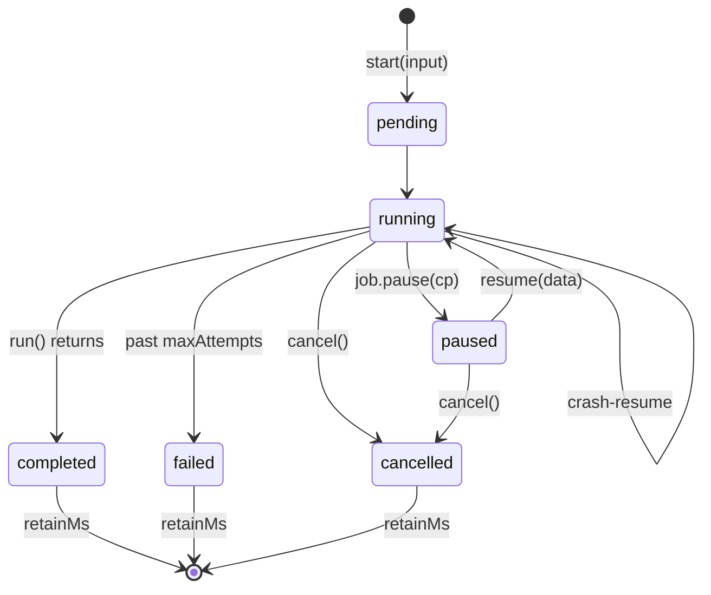

# Jobs

<p class="lede">`defineJob` is the packaged experience on top of [tasks](/actors/docs/tasks).
Start a job from a request handler and return immediately; check on it from anywhere in the
cluster.</p>

```ts
import { defineJob } from '@sigx/actors/job';

export const SecuritySync = defineJob({
    type: 'SecuritySync',
    authorize: requireStaff,
    maxAttempts: 3,          // crash-resume attempts before 'failed'
    retainMs: 86_400_000,    // keep the terminal record a day, then forget
    run: async (job, input: { providerId: string }) => {
        const users = await loadUsers(input.providerId, { signal: job.signal });
        const from = (job.resumedFrom as { cursor: number } | undefined)?.cursor ?? 0;
        for (let i = from; i < users.length; i++) {
            job.signal.throwIfAborted();
            await syncOne(users[i]);
            await job.progress({ done: i + 1, total: users.length });
            if (i % 100 === 0) await job.checkpoint({ cursor: i + 1 });
        }
        return { synced: users.length };
    },
});
```

```ts
// A request handler — returns immediately, the job runs on the cluster:
const runId = crypto.randomUUID();
await actor(SecuritySync, runId).start({ providerId });

// Later, from anywhere:
await actor(SecuritySync, runId).status();   // JobInfo: status/progress/attempts
await actor(SecuritySync, runId).cancel();
await actor(SecuritySync, runId).result();   // the return value, once completed
```

`watch()` is a stream of `JobInfo`, so a progress bar is a component that consumes it:

```tsx
import { component, onMounted, signal } from 'sigx';

const JobProgress = component<{ runId: string }>(({ props }) => {
    const info = signal<JobInfo | null>(null);

    onMounted(async () => {
        for await (const next of actor(SecuritySync, props.runId).watch()) info.value = next;
    });

    return () => (
        <progress value={info.value?.progress?.done ?? 0} max={info.value?.progress?.total ?? 1} />
    );
});
```

### Throttle the feed for consumers that redraw

`watch({ throttleMs })` coalesces per subscriber: at most one `JobInfo` per window, leading
edge plus a trailing emit taken fresh, so a watcher is never staler than the window. It
forwards `ctx.changes()`'s throttle exactly, validation included.

```ts
for await (const info of actor(SecuritySync, runId).watch({ throttleMs: 250 })) render(info);
```

Set it whenever the consumer **redraws rather than accumulates** — a progress bar, a status
tile. An unthrottled watcher costs one whole-state snapshot per mutating turn, and a job that
reports progress per step over state that grows through the run pays that on every step: on
such a job the unthrottled feed measured at about 2.5× the per-step cost, and the throttled
one at the unwatched floor.

It never loses the end of the run. A window still owing an emit when the actor deactivates is
flushed, so a throttled watcher always sees the terminal `JobInfo` before the feed ends.
Omitting the option keeps one `JobInfo` per mutating turn.

## What the layer decides for you

**The state machine.** `status()` and `watch()` return `JobInfo` — never the checkpoint, which
is private, and never the result, which is fetched once via `result()`.

**Reads cost O(1), not O(state).** `status()`, `JobControl.info`, the `onSettled` argument and
the info returned by `start`/`cancel`/`resume` are built from live state without cloning the
whole record. `JobInfo.progress` on that path is a shallow copy of its declared all-primitive
shape; the `watch()` feed is a full snapshot. A job checkpointing a growing table keeps
its status reads flat however large the state gets.



**One actor per run**, keyed by your run id. The directory's single-activation guarantee *is*
the "exactly one runner" guarantee — there is no separate lock.

**`start` is idempotent under retry.** A non-pending job returns its current info and never
restarts. Safe to call from a handler that a client may retry.

**Crash-resume counts; pause-resume is free.** A crash-resumed run arrives with `job.attempt`
bumped and `job.resumedFrom` set to the last checkpoint. Past `maxAttempts` the job is marked
`failed`. `resume(data)` on a paused job re-runs with `job.resumeData` and costs no attempt.

**`pause` parks durably.** `return job.pause(checkpoint)` writes the checkpoint, marks
`paused` and releases the task — the actor idles at zero cost until `resume()`. For a timeout,
arm `job.reminders` before pausing and handle it in `onReminder(control, name)`;
`control.resume()` and `control.cancel()` are internal, so there is no self-dispatch deadlock.

**Progress rides the change feed, not storage.** `job.progress()` — and `job.update()` for
your own `state:` extra fields — mutate state in a turn so `watch()` pushes them live, but
nothing is persisted per tick. After a crash, progress honestly **regresses to the last
checkpoint** rather than claiming ground the work did not keep.

**`retainMs`** keeps the terminal record around for late `result()` readers, then a one-shot
reminder clears the state and deactivates. `discard()` does it on demand.

## Checkpoints are the contract

`progress()` is for humans; `checkpoint()` is for the runtime. Only a checkpoint survives a
crash, so how often you call it is how much work you are willing to redo.

The resume contract is **at-least-once**: the runtime resumes the function, and your code
resumes the work by reading `job.resumedFrom`. Make the step after a checkpoint idempotent.

## Projecting status outside the job

`onSettled` fires on **every** terminal transition, which is what makes it safe to keep a
projection — a status row in your own database, a metric, a notification — in step with the
job:

```ts
export const ImportJob = defineJob({
    type: 'Import',
    async run(job) { /* … */ },
    async onSettled(control, info) {
        await db.imports.update(info.key, { status: info.status });
    },
});
```

Two of those transitions cannot be observed from inside `run()` at all, which is the reason
the hook exists:

- **The `maxAttempts` give-up.** The body is re-entered, sees `attempts > maxAttempts`, and
  finishes as failed without ever calling your `run` — so there is no body turn to write from.
- **`cancel()` on a paused job.** A paused job holds no task, so nothing in the body is around
  to notice.

Without the hook, a projection written only from `run()` asserts "still running" forever after
either one.

The contract:

- **It runs after the save.** The transition is already durable and `info` is the final state.
  A handler that throws is caught, logged in dev, and swallowed — it cannot unwind the settle.
- **It fires for `completed` too**, not only the runtime-driven cases, so handlers should be
  **idempotent**.
- **No self-dispatch**, the same rule as `onReminder`: it receives a `JobControl`, not a
  client.
- **Awaiting slow I/O holds the actor's turn.** Hand long work to a
  [task](/actors/docs/tasks) rather than blocking the settle.

## `migrateState` is not supported

> **`defineJob` does not accept `migrateState`.** `JobOptions` has no such option and the
> underlying `defineActor` config forwards nothing.
>
> The reasoning is worth a sentence: a job's stored record **is** the job envelope —
> `status`, `progress`, `checkpoint` and the rest, with your own state under `extra`. A hook
> over that would hand you a runtime shape you do not own. Migrating the `extra` half wants
> its own option, and is not part of this.

See [State & persistence](/actors/docs/state-and-persistence) for migration on ordinary
actors.

## Recipes, not API

A singleton queue-worker with strict ordering and bounded concurrency, a cron-on-reminders
scheduler, and the Cloudflare Durable Object posture are all **patterns** rather than
features. They are written up in `docs/job-recipes.md` in the actors repo, deliberately left
out of the API so the job layer stays one thing done well.

## Next steps

- [Tasks](/actors/docs/tasks) — the primitive underneath, and the crash-resume machinery.
- [Timers & reminders](/actors/docs/timers-and-reminders) — pausing with a timeout.
- [Clustering](/actors/docs/clustering) — where a resumed job comes back.
