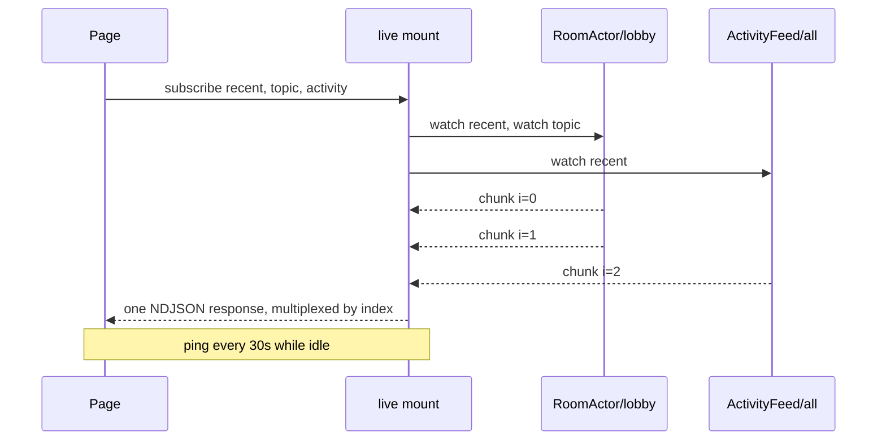

# Live reads

<p class="lede">Ordinary reads refresh only the tab that wrote. `{ live: true }` is what makes a
second browser update without a reload.</p>

```ts
const messages = useActorState(RoomActor, room, 'recent', 20, { live: true });
const topic = useActorState(RoomActor, room, 'topic', { live: true });
```

The actor re-runs **the read you declared** after every turn that mutated its state — whoever
caused it — and pushes the result.

That is why the feed is per *subscription* rather than a state snapshot: `topic` is a method,
and only the actor can compute a method's result from its state. The derivation *is* the
method.

## What it costs and what it guarantees

**One connection for the whole page.** Every live read rides a single held-open NDJSON
response (`$live#subscribe`), multiplexed by subscription index, pinging every 30 seconds so
proxies and mobile NATs leave it alone. Twelve live components do not open twelve connections.



**The first paint is unchanged.** The ordinary read still seeds the cell, SSR still serializes
it, and hydration still costs no request. `live` is purely additive — note that options go
last in the positional form, after the method arguments.

**A set change reopens the connection.** A `fetch` POST body is not duplex, so a newly mounted
component cannot be pushed onto an open stream. The channel coalesces set changes (~20 ms),
aborts, and reopens carrying the new set. Every subscription re-seeds on open, which is why a
reconnect needs no resume token.

**An unchanged value is dropped, not delivered.** Two things produce one routinely: the
re-seed above — one widget mounting must not look like the whole page updating — and the fact
that a mutating turn re-runs *every* subscription on that actor, so changing a room's topic
re-runs its `recent(20)` watch too and gets an identical list back. These are views of current
state, not an event log, so a subscriber cannot need to know that a value it already holds was
recomputed.

**It reconnects by itself.** A long-lived response dies for reasons that are nobody's bug — a
proxy timeout, a rolling restart, a laptop lid. Backoff doubles 1s → 30s with jitter and
resets on any healthy frame, and the re-seed doubles as the catch-up read.

**A dead feed degrades to "not live", never to "broken".** One subscription's failure — a
guard rejection, say — is delivered to that read alone and leaves the rest of the page live. A
read whose feed cannot be established at all keeps working as a plain read.

**A subscriber costs the actor almost nothing per turn.** A watch re-invokes the read method
and the pump reads only the iterator's `done` flag, so a subscriber whose value nobody is
waiting on receives a value-free tick and the runtime builds no snapshot for it at all. State
size is a question for your own reads, not a reason to avoid `live: true`.

**Nothing subscribes during SSR.** The subscription lives in `onMounted`.

**Security is the read's own.** A subscription runs the same policy as a unary call, at
subscribe time, so it exposes nothing a polling client could not already read. There is
deliberately **no** per-actor `live` opt-in to configure.

## Cross-host works without configuration

Each subscription dispatches through placement, so watching an actor another host owns rides
the [host-to-host transport](/actors/docs/transports). Nothing to set up.

`$live` is never routed or redirected — one held-open response fans out to many actors, so no
single actor can claim it. Two consequences worth knowing:

- The [routing token](/actors/docs/locality-routing) does not apply, so a live subscription
  keeps paying the cross-host hop even in a cluster tuned for ~100% locality.
- An open watch counts as activity, so [idle collection](/actors/docs/lifecycle) cannot
  deactivate an actor out from under a subscriber.

**Clients never connect to an actor's owning host.** Hosts relay, and the relay hop is cheap
— which is what lets the fan-out scale.

### Subscribers share one stream

Each relaying host holds **one** cross-host stream per
`(actor, method, throttleMs, args, principal)` and fans it out locally. Owner-side delivery is
therefore **O(hosts), not O(subscribers)**: the write ceiling moves *with* fleet size instead
of against it.

The shared stream is pulled at the **fastest** consumer's rate. A slower subscriber drops
oldest at a 16-value buffer, so a stalled tab cannot backpressure anyone else on the stream —
superseded live values are worthless by definition.

A shared-stream failure fails **every** subscriber on it and drops the entry. Recovery is the
`$live` channel's ordinary reconnect-and-reseed, unchanged.

Two counters report it: `remoteWatches` counts remote watch **streams**, and
`coalescedWatches` counts attaches that joined an existing one.

### Identity-dependent reads split automatically

A watch loop is shared per `(method, args, throttleMs)`, which would be wrong for a read whose
result depends on who is asking. So the runtime observes whether a read actually consults
`ctx.principal`, and **only then** splits that key's loop per encoded principal.

Reads that never touch identity keep one shared loop however many subscribers it has;
same-principal subscribers still share. There is nothing to opt into — a caller observes only
that the value is theirs. One touch anywhere in the read, even a discarded one, marks the
method for the activation's lifetime; it is rediscovered from scratch after failover or idle
collection.

The split is per *principal*, not per subscriber — one identity watching a principal-reading
method costs one loop however many tabs it has open. But P distinct identities on one actor
are P loops, each re-reading after every mutating turn, and that is the number
[sizing](#sizing-live-fan-out) is about.

### Declaring a read identity-blind: `watches`

The cross-host relay cannot see the owner's discovery, so it keys its coalesced stream on the
caller's principal **whether or not the read consults it**. Ten thousand anonymous subscribers
across three hosts cost two cross-host streams; ten thousand signed-in ones cost ten thousand
— even on a read that never looks at identity — and each stream pins a pooled host-to-host
connection for the life of its subscription.

Unless the method says otherwise:

```ts
defineActor({
    type: 'ActivityFeed',
    watches: { all: { principalIndependent: true } },
    methods: (ctx) => ({ all: () => [...ctx.state.entries] }),
});
```

`watches` is a static per-method map on the definition, beside `reads`, `methodAuthorize` and
`methodReentrancy`. The relay drops the principal from that method's key, and the whole
signed-in population shares one stream again — two rather than ten thousand.

**Unlike `reads:`, this promise is enforced.** A declared read observed consulting
`ctx.principal` fails the watch with
[`ActorWatchDeclarationError`](/actors/docs/errors) (`kind: 'watch-declaration'`) — in every
build, on the owner, whether or not any relay coalesced. It fails closed and does not heal on
re-subscribe or failover, because the declaration is source code while the discovery it
contradicts is per activation. Remove the flag or the `ctx.principal` read.

Three things the declaration deliberately does not cover:

- **`ctx.bag`** is already first-subscriber-only on any coalesced stream, declared or not.
  This is a promise about *identity* only — which is why it is not spelled
  "caller-independent".
- **Identity reached through `ctx.actor()` into another actor** is invisible to the check.
- **A touch that only authorizes trips it too.** Authorization belongs in `authorize` /
  `methodAuthorize`, which run per subscriber at the entry point, outside any turn.
  Coalescing shares a *read*, never a decision.

```ts
// ✗ trips the declaration — the touch is only there to authorize
watches: { all: { principalIndependent: true } },
methods: (ctx) => ({
    all() {
        if (!ctx.principal) throw new ServerFnError(401, 'sign in first');
        return [...ctx.state.entries];
    },
}),

// ✓ the decision runs per subscriber; the shared read never sees identity
methodAuthorize: { all: requireAuthenticated },
watches: { all: { principalIndependent: true } },
methods: (ctx) => ({ all: () => [...ctx.state.entries] }),
```

Two operational notes. A relay that cannot resolve the definition — a routing-only host, a
failed module load — keys per principal, the conservative direction. And during a rolling
deploy a new relay may share a stream that an old owner does not yet police; the shared
stream carries no principal at all, so the worst case is everyone seeing the anonymous view.
Deploy the declaration before relying on it.

## Ask for a slower delivery window

A subscription may carry `throttleMs` — how *stale* this subscriber is willing to be. It rides
the wire as `w` on the subscription entry, so `$live` and the
[socket transport](/actors/packages/actors-ws/overview) both carry it, and a transport that
implements `live()` receives it on the `ActorSubscription` it is handed.

```ts
channel.subscribe({ type: 'Room', key: 'general', method: 'feed', throttleMs: 1000 }, onValue);
```

**The server does not honour the number verbatim.** It floors the request at the runtime's
own 50 ms watch throttle and rounds it **up** to one of a fixed ladder —
`DEFAULT_THROTTLE_POLICY` is 50, 250, 1000, 5000 ms; anything above the ladder gets the top
bucket. Ask for what the view needs rather than a precise figure: a tile that refreshes once a
second says `1000`.

Why a ladder: `throttleMs` is part of the watch identity and of the cross-host coalescing key,
so honouring arbitrary values would give every distinct number its own watch loop and its own
cross-host stream — undoing exactly the sharing that makes fan-out scale, and a socket may
hold 256 subscriptions. The ladder caps fragmentation at `|buckets|` loops whatever clients
send. `socketStats().throttleQuantized` counts the subscriptions whose request was moved, so
"why is my 300 ms tile updating every second?" has an answer.

Why it is worth setting: a delivery is ~77% socket write, and every subscriber is its own
socket, so a publish costs one write syscall per subscriber. A subscriber on a 1 s window
costs the host a twentieth of the sends a default one does. This is the single biggest thing
an app author can do for live fan-out cost.

Two things do not change. Omitting `throttleMs` is the default behaviour, and a client that
omits it shares a watch loop with one that asks for 50 — nobody is opted in by accident. And
the direction is one-way: under the default policy a client can only ask to be served more
*slowly*. Going faster is an operator decision on the socket session —
`throttlePolicy: { min: 0, buckets: [0, 16, 50] }` — and `{ min: 50, buckets: [50] }` turns
the feature off. See [Socket sessions](/actors/docs/socket-sessions). The `$live` mount runs
the default ladder.

A malformed window is refused rather than defaulted — per subscription on the socket, per
request on `$live`.

## Sizing live fan-out

Anonymous and signed-in fan-out are different products, and the two must never be averaged.

A read that never touches `ctx.principal` scales to the **tens of thousands of subscribers on
one actor**: one loop, one re-read per mutating turn, a late joiner replays the loop's last
value and enqueues no turn at all. A read that touches it once is one loop **per distinct
identity**, each with its own change subscription, its own re-read per publish, and — across
hosts, unless declared `principalIndependent` — its own stream pinning one pooled
host-to-host connection for the life of the subscription.

Watch reads do not each hold a queue slot: they drain through a **watch read pump** that keeps
at most one turn on the actor's queue, runs pending reads back-to-back in slices, and drains a
new subscriber's seed ahead of every pending re-read. The whole watch population costs O(1)
queue slots however many loops exist, and establishment cannot starve behind steady-state
fan-out. What remains per identity is the reads themselves and, cross-host, the connection —
which is why the durable rule, cheapest option first, is:

1. **Declare the read** `principalIndependent` if it really is identity-blind — the
   per-identity stream, and the connection it pins, stop existing rather than being budgeted
   for.
2. **Shard genuinely identity-dependent reads.** Keep `mine()`-shaped reads off hot shared
   actors: a per-user or per-cohort actor holds the identity-dependent projection and the
   shared actor publishes to it, or the read takes the identity as an explicit *argument* on
   a caller-validated path so args, not principals, key the loops.
3. Otherwise **size the host-to-host fetch pool** for the signed-in watcher population, or
   use [`@sigx/actors-tcp`](/actors/packages/actors-tcp/overview), whose one multiplexed
   connection per peer makes the pool arithmetic moot whatever the reads do.

**The gauge to watch is `watchLoops`** — `HostStats.watchLoops` in
[`ops()`](/actors/docs/ops-endpoint), `metrics()` and the cluster `HostReport`, and
`ActivationInfo.watchLoops` / `watchSubscribers` on the activation list for the per-actor
drill-down. Many subscribers per loop is healthy sharing. A loop count tracking the subscriber
count on a hot actor is the per-identity split building.

Over a socket, a subscription whose first value cannot be produced within the app posture's
`timeoutMs` receives a per-subscription **504 error frame**, and the server releases the
watch it held. A subscription that has delivered its first value is never timed out —
pushes arrive at the watch loop's own cadence.

## Live reads or streams?

Use **`{ live: true }`** for *current state* — a message list, a topic, a presence count, a
score. The value is always the latest, and you never see intermediate frames.

Use a [**`streams:` method**](/actors/docs/streams) for a *feed that is not a read* — a log
tail, a progress sequence, an event history where every item matters and dropping an
unchanged one would be wrong.

## Tuning

```ts
actorsPlugin({ live: { debounceMs, retryMs, maxRetryMs, onError } });
```

A transport that brings its own `live()` channel — a WebSocket transport, say — is used
instead of the NDJSON one, with no call site changing.

### Bounding the subscription array

`$live#subscribe` caps its subscription array at **256** by default.

The mount fans out one watch per entry, all started at once, and each can force a distinct
activation pinned for `idleAfterMs`. A minimal entry is about 25 bytes, so the 1 MiB body cap
alone bought tens of thousands of activations from a single unauthenticated request — and the
per-subscription policies run *inside* that fan-out, so they never bounded it.

```ts
handleActorRequest(request, { host, maxLiveSubscriptions: 64 });
```

The option flows through `createFetchHandler` and `createAppHandler` too, and `0` disables it.
An over-cap array is a `400` for the whole request, checked before the per-entry walk —
answering per index would mean doing the work first.

Anything that is not a non-negative integer **throws**: under a plain `> 0` test a typo like
`-1` would silently turn the cap off, which is the exact state the option exists to prevent.

The cap joins the resolver cache key, so two mounts on one host with different caps do not
share whichever resolver happened to be built first.

## Under the hood

The mount is a synthesized server function, so it inherits the origin policy, codec,
`ServerFnError` masking, body caps, `onError` and the request scope. Its shape:

```
POST {base}/%24live%23subscribe
{"args":[[ {"t":"Room","k":"lobby","m":"recent","a":[20],"w":1000}, … ]]}
→ {"chunk":{"i":0,"v":<encoded>}}
  {"chunk":{"i":1,"e":{message,status}}}   ← failure is per subscription
  {"chunk":{"p":1}}                        ← keepalive ping
  {"done":1}
```

An error frame carries the status the same call would have received as a unary request. `w`
is the optional requested delivery window from [above](#ask-for-a-slower-delivery-window).

## Next steps

- [Streams](/actors/docs/streams) — when a feed is not a read.
- [Reads & writes in components](/actors/docs/in-components) — the non-live half.
- [Wire protocol](/actors/docs/wire-protocol) — reserved symbols and the endpoint.
