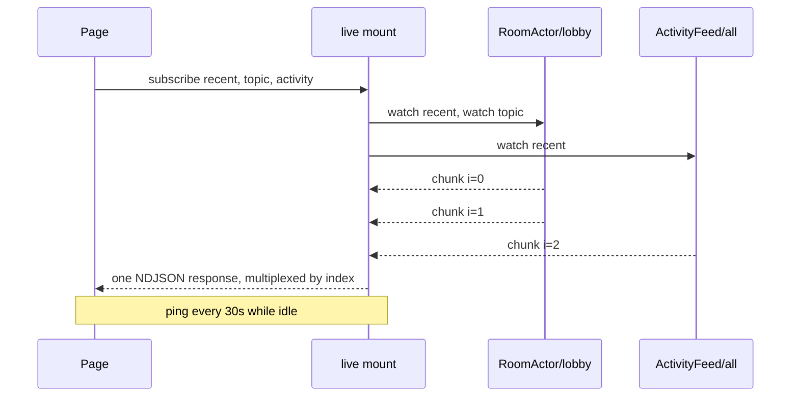

# Live reads

<p class="lede">Ordinary reads refresh only the tab that wrote. `{ live: true }` is what makes a
second browser update without a reload.</p>

```ts
const messages = useActorState(RoomActor, room, 'recent', 20, { live: true });
const topic = useActorState(RoomActor, room, 'topic', { live: true });
```

The actor re-runs **the read you declared** after every turn that mutated its state — whoever
caused it — and pushes the result.

That is why the feed is per *subscription* rather than a state snapshot: `topic` is a method,
and only the actor can compute a method's result from its state. The derivation *is* the
method.

## What it costs and what it guarantees

**One connection for the whole page.** Every live read rides a single held-open NDJSON
response (`$live#subscribe`), multiplexed by subscription index, pinging every 30 seconds so
proxies and mobile NATs leave it alone. Twelve live components do not open twelve connections.



**The first paint is unchanged.** The ordinary read still seeds the cell, SSR still serializes
it, and hydration still costs no request. `live` is purely additive — note that options go
last in the positional form, after the method arguments.

**A set change reopens the connection.** A `fetch` POST body is not duplex, so a newly mounted
component cannot be pushed onto an open stream. The channel coalesces set changes (~20 ms),
aborts, and reopens carrying the new set. Every subscription re-seeds on open, which is why a
reconnect needs no resume token.

**An unchanged value is dropped, not delivered.** Two things produce one routinely: the
re-seed above — one widget mounting must not look like the whole page updating — and the fact
that a mutating turn re-runs *every* subscription on that actor, so changing a room's topic
re-runs its `recent(20)` watch too and gets an identical list back. These are views of current
state, not an event log, so a subscriber cannot need to know that a value it already holds was
recomputed.

**It reconnects by itself.** A long-lived response dies for reasons that are nobody's bug — a
proxy timeout, a rolling restart, a laptop lid. Backoff doubles 1s → 30s with jitter and
resets on any healthy frame, and the re-seed doubles as the catch-up read.

**A dead feed degrades to "not live", never to "broken".** One subscription's failure — a
guard rejection, say — is delivered to that read alone and leaves the rest of the page live. A
read whose feed cannot be established at all keeps working as a plain read.

**A subscriber costs the actor almost nothing per turn.** A watch re-invokes the read method
and the pump reads only the iterator's `done` flag, so a subscriber whose value nobody is
waiting on receives a value-free tick and the runtime builds no snapshot for it at all. State
size is a question for your own reads, not a reason to avoid `live: true`.

**Nothing subscribes during SSR.** The subscription lives in `onMounted`.

**Security is the read's own.** A subscription runs the same policy as a unary call, at
subscribe time, so it exposes nothing a polling client could not already read. There is
deliberately **no** per-actor `live` opt-in to configure.

## Cross-host works without configuration

Each subscription dispatches through placement, so watching an actor another host owns rides
the [host-to-host transport](/actors/docs/transports). Nothing to set up.

`$live` is never routed or redirected — one held-open response fans out to many actors, so no
single actor can claim it. Two consequences worth knowing:

- The [routing token](/actors/docs/locality-routing) does not apply, so a live subscription
  keeps paying the cross-host hop even in a cluster tuned for ~100% locality.
- An open watch counts as activity, so [idle collection](/actors/docs/lifecycle) cannot
  deactivate an actor out from under a subscriber.

**Clients never connect to an actor's owning host.** Hosts relay, and the relay hop is cheap
— which is what lets the fan-out scale.

### Subscribers share one stream

Each relaying host holds **one** cross-host stream per
`(actor, method, throttleMs, args, principal)` and fans it out locally. Owner-side delivery is
therefore **O(hosts), not O(subscribers)**: the write ceiling moves *with* fleet size instead
of against it.

The shared stream is pulled at the **fastest** consumer's rate. A slower subscriber drops
oldest at a 16-value buffer, so a stalled tab cannot backpressure anyone else on the stream —
superseded live values are worthless by definition.

A shared-stream failure fails **every** subscriber on it and drops the entry. Recovery is the
`$live` channel's ordinary reconnect-and-reseed, unchanged.

Two counters report it: `remoteWatches` counts remote watch **streams**, and
`coalescedWatches` counts attaches that joined an existing one.

### Identity-dependent reads split automatically

A watch loop is shared per `(method, args, throttleMs)`, which would be wrong for a read whose
result depends on who is asking. So the runtime observes whether a read actually consults
`ctx.principal`, and **only then** splits that key's loop per encoded principal.

Reads that never touch identity keep one shared loop however many subscribers it has;
same-principal subscribers still share. There is no API for this and nothing to opt into — a
caller observes only that the value is theirs.

Distinct authenticated principals do not yet share a stream even where the read is
identity-independent in practice.

## Live reads or streams?

Use **`{ live: true }`** for *current state* — a message list, a topic, a presence count, a
score. The value is always the latest, and you never see intermediate frames.

Use a [**`streams:` method**](/actors/docs/streams) for a *feed that is not a read* — a log
tail, a progress sequence, an event history where every item matters and dropping an
unchanged one would be wrong.

## Tuning

```ts
actorsPlugin({ live: { debounceMs, retryMs, maxRetryMs, onError } });
```

A transport that brings its own `live()` channel — a WebSocket transport, say — is used
instead of the NDJSON one, with no call site changing.

### Bounding the subscription array

`$live#subscribe` caps its subscription array at **256** by default.

The mount fans out one watch per entry, all started at once, and each can force a distinct
activation pinned for `idleAfterMs`. A minimal entry is about 25 bytes, so the 1 MiB body cap
alone bought tens of thousands of activations from a single unauthenticated request — and the
per-subscription policies run *inside* that fan-out, so they never bounded it.

```ts
handleActorRequest(request, { host, maxLiveSubscriptions: 64 });
```

The option flows through `createFetchHandler` and `createAppHandler` too, and `0` disables it.
An over-cap array is a `400` for the whole request, checked before the per-entry walk —
answering per index would mean doing the work first.

Anything that is not a non-negative integer **throws**: under a plain `> 0` test a typo like
`-1` would silently turn the cap off, which is the exact state the option exists to prevent.

The cap joins the resolver cache key, so two mounts on one host with different caps do not
share whichever resolver happened to be built first.

## Under the hood

The mount is a synthesized server function, so it inherits the origin policy, codec,
`ServerFnError` masking, body caps, `onError` and the request scope. Its shape:

```
POST {base}/%24live%23subscribe
{"args":[[ {"t":"Room","k":"lobby","m":"recent","a":[20]}, … ]]}
→ {"chunk":{"i":0,"v":<encoded>}}
  {"chunk":{"i":1,"e":{message,status}}}   ← failure is per subscription
  {"chunk":{"p":1}}                        ← keepalive ping
  {"done":1}
```

An error frame carries the status the same call would have received as a unary request.

## Next steps

- [Streams](/actors/docs/streams) — when a feed is not a read.
- [Reads & writes in components](/actors/docs/in-components) — the non-live half.
- [Wire protocol](/actors/docs/wire-protocol) — reserved symbols and the endpoint.
