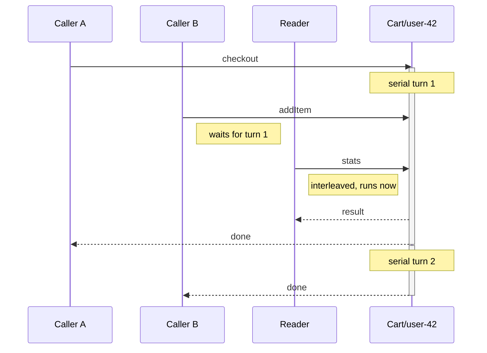

# Turns & concurrency

<p class="lede">Actor state is race-free because of one mechanism, and it is worth understanding
before anything else here: an activation runs its work in <strong>turns</strong>, and by default
only one turn runs at a time.</p>

## What a turn is

A **turn** is one execution of one method against one activation. It begins when the runtime
dispatches the call and ends when the method's promise **settles** — not when the method stops
running.

That distinction is the whole thing:

```ts
async checkout() {
    const quote = await fetch('https://slow.example/quote');  // the turn is still open
    ctx.state.total = await quote.json();
    await ctx.save();
}                                                            // now the turn ends
```

Between two `await`s nothing else touches this actor's state. That is why
`ctx.state.items.push(item)` is safe with no lock, no transaction and no compare-and-set loop.

## Turns chain, they do not queue

Each new turn attaches to the tail of a promise chain with `.then()`. Nothing is stored between
them, so the ordering you get is the ordering of arrival and nothing else.

That has a practical consequence worth knowing before you go looking: the `queued` number in
[`host.activations()`](/actors/docs/lifecycle) and the
[ops endpoint](/actors/docs/ops-endpoint) is a **counter**, not the length of a structure you
can inspect. There is no priority lane to configure, no bounded-queue policy to tune, and no
way to drop or reorder pending work.

If your design needs any of those, put them in your own code in front of the actor — a queue
you own, with the policy you want, calling the actor as its consumer.

## Two lanes

An activation runs turns in one of two ways, and which one a call takes is a property of the
actor or the method, not of the caller.

**The serial lane** is the default. Each turn waits for the previous one to settle. This is
what makes plain mutation safe.

**The interleaved lane** does not wait and is not waited for. A call takes it when the actor
declares [`reentrant: 'always'`](/actors/docs/reentrancy), or when the method is named in
`methodReentrancy`.



The consequence is the trade you are making when you reach for the interleaved lane: a turn
there can observe state changing across every `await`, so it must re-read rather than cache
anything another turn may have moved.

## Why `await` blocks the serial lane

Because a turn ends when the promise settles, an awaited call inside a method keeps the serial
lane occupied for its whole duration:

```ts
async checkout() {
    await fetch('https://slow.example/quote');   // every queued turn for THIS actor waits
}
```

Nothing else is affected — other actors are other activations — but this one is blocked. Dev
builds warn when a turn exceeds `slowTurnMs` (default 5s), and a persistently non-zero `queued`
count is the same symptom seen from outside.

This is a deliberate trade: **state safety over concurrency within one actor.** The runtime
could have released the lane at each `await` and given you neither.

When it hurts, the three ways out, in order of preference:

1. **Move the I/O out of the turn** — do the slow call in the caller and pass the result in.
2. **Move it to a [task](/actors/docs/tasks)**, which runs outside the turn sequence entirely
   and re-enters through `ctx.turn()` only to touch state.
3. **Let that one method interleave** with
   [`methodReentrancy`](/actors/docs/reentrancy) — the usual fit for a read that must not queue
   behind slow writes.

## What runs outside the turn sequence

Not everything an actor does is a turn, and the exceptions are deliberate:

| Runs outside | Why |
|---|---|
| [Authorization](/actors/docs/guards) | a slow auth check must not occupy the actor |
| [Stream bodies](/actors/docs/streams) | a stream awaiting its own actor's next turn would deadlock against itself |
| [Task bodies](/actors/docs/tasks) | long work must not block ordinary calls |

Each of those reads state through a snapshot rather than touching it live.

## Two schedulers, different jobs

The runtime has two things called a scheduler, and conflating them will confuse a debugging
session:

| | Decides |
|---|---|
| **Turn scheduling** | in what **order** and with what **overlap** an activation's turns run. No clock involved. |
| **`ActorScheduler`** | **when in wall-clock time** something fires — timers, reminder ticks, idle sweeps, write-behind flushes. Swappable via `CreateHostOptions.scheduler`; `manualScheduler()` makes time deterministic in tests. |

If your question is "why did these two calls overlap?", it is the first. If it is "why did this
fire late?", it is the second — see
[Timers & reminders](/actors/docs/timers-and-reminders) and the coarse-deadline note in
[Errors](/actors/docs/errors).

## Next steps

- [The actor model](/actors/docs/actor-model) — identity, activation and deactivation.
- [Reentrancy & interleaving](/actors/docs/reentrancy) — opting into the second lane.
- [Tasks](/actors/docs/tasks) — work that outlives a turn.
