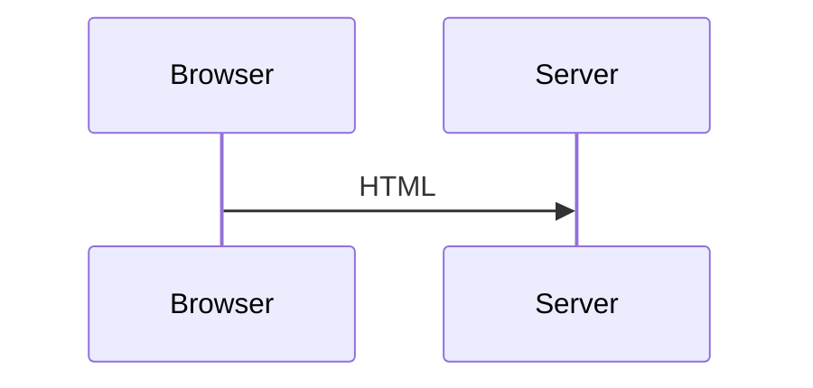

import { PkgVersion } from '@/components/PkgVersion';

# Mermaid

<p class="lede"><a href="https://mermaid.js.org/">Mermaid</a> diagrams for sigx — a <code>&lt;Mermaid&gt;</code> component for any app, and drop-in <code>```mermaid</code> fence support for <a href="/ssg/docs/getting-started">@sigx/ssg</a> sites.</p>

<p class="mod-meta-row"><PkgVersion npm="@sigx/mermaid" /> <span class="mmr-dot" /> ESM-only <span class="mmr-dot" /> MIT</p>

```bash
pnpm add @sigx/mermaid mermaid
```

`mermaid` itself is a peer dependency — you control which version renders your diagrams.

## Why it exists

A docs site without diagrams explains architecture in prose. This package makes fences just work, without giving up the things a static site is for:

- **The diagram source stays in the HTML.** It is readable, greppable and indexable, and it survives with JavaScript off.
- **mermaid loads only on pages that have a diagram**, and only once one scrolls into view.
- **Diagrams re-theme when the reader flips light/dark**, rather than staying committed to the palette they were first drawn in.

## In an app

```tsx
import { Mermaid } from '@sigx/mermaid';

<Mermaid code={`
  sequenceDiagram
    Browser->>Server: GET /
    Server-->>Browser: HTML
`} />
```

## In an SSG site

Two lines. `remarkMermaid` claims the fence on the markdown tree, before the syntax highlighter ever sees it:

```ts
// ssg.config.ts
import { defineSSGConfig } from '@sigx/ssg';
import { remarkMermaid } from '@sigx/mermaid/ssg';

export default defineSSGConfig({
    markdown: {
        remarkPlugins: [remarkMermaid],
    },
    clientImports: ['@sigx/mermaid/styles', '@sigx/mermaid/client'],
});
```

Then write a fence:

````mdx

````

See [SSG integration](/mermaid/docs/ssg) for the details.

## Why not render at build time?

Rendering to SVG during the build would mean zero client JavaScript, and it is the obvious thing to want.

mermaid cannot do it without a browser: it measures text with `getBBox`, which neither jsdom nor happy-dom implements faithfully. That leaves a headless Chromium — slow builds and a ~300 MB dependency — or `isomorphic-mermaid`, which is svgdom-based, young, and approximate on font metrics.

Neither is a good default. So this package renders on the client and keeps the cost honest: the source is always in the HTML, and mermaid is never loaded for a diagram nobody scrolled to.

## What's here

- [Usage](/mermaid/docs/usage) — the component, configuration and theming.
- [SSG integration](/mermaid/docs/ssg) — `remarkMermaid` and the client enhancer.
- [API reference](/mermaid/docs/api) — every export.
