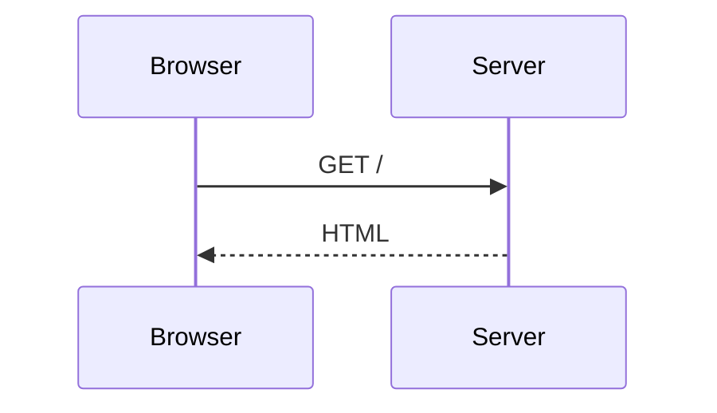

# SSG integration

<p class="lede">Write a <code>```mermaid</code> fence in MDX and get a diagram. Two lines of
<a href="/ssg/docs/getting-started">@sigx/ssg</a> config, and nothing to keep in sync with the
highlighter.</p>

## Setup

```ts
// ssg.config.ts
import { defineSSGConfig } from '@sigx/ssg';
import { remarkMermaid } from '@sigx/mermaid/ssg';

export default defineSSGConfig({
    markdown: {
        remarkPlugins: [remarkMermaid],
    },
    clientImports: ['@sigx/mermaid/styles', '@sigx/mermaid/client'],
});
```

Two pieces:

1. **`remarkMermaid`** claims the fence on the **markdown** tree (mdast), before HTML
   conversion. Nothing downstream ever sees a mermaid fence — including the syntax
   highlighter — so there is no `skipLanguages` to configure and nothing to keep in step.
2. **`clientImports`** adds the styles and the enhancer that renders the diagrams in the
   browser.

Then write a fence:

````mdx

````

`title` on the fence becomes the `<figcaption>`.

<div class="alert alert-info not-prose my-4">
  <div>
    <strong>Neither plugin renders anything.</strong> They emit a
    <code>&lt;figure data-sigx-mermaid&gt;</code> shell that the client enhancer upgrades to an
    SVG. Rendering at build time needs real text metrics (<code>getBBox</code>), which means a
    headless browser.
  </div>
</div>

## Where in the pipeline

Both plugins emit the same shell. They differ only in which stage hands them the tree, and that
difference decides whether the highlighter is a problem:

| | stage | tree | interacts with the highlighter? |
|---|---|---|---|
| `remarkMermaid` | markdown | mdast | **No** — it claims the fence before HTML conversion |
| `rehypeMermaid` | HTML | hast | **Yes** — it claims whatever `<pre><code class="language-mermaid">` is still in the tree when it runs, so anything ordered before it can take the fence first |

Prefer `remarkMermaid`. Reach for `rehypeMermaid` only when the fence has to survive into the
HTML tree for something else to see first — and then order it deliberately and add
`markdown.shiki.skipLanguages: ['mermaid']`, or the highlighter gets there first and there is
nothing left to claim.

The plugins are **optional** either way: `@sigx/mermaid/client` also claims a bare
`pre > code.language-mermaid`. What the shell buys is a stable class hook, a `<figcaption>`
from the fence's `title=`, and a reserved box so the page does not jump when the SVG lands.

## Plugin options

Usable bare (`remarkPlugins: [remarkMermaid]`) or configured
(`remarkPlugins: [[remarkMermaid, { language: 'mmd' }]]`). Both plugins take the same two:

| Option | Default | Description |
| --- | --- | --- |
| `language` | `'mermaid'` | The fence language this plugin claims. |
| `className` | `'sigx-mermaid'` | Class on the emitted `<figure>`. |

For `rehypeMermaid` the language is matched as `language-<language>` on the `<code>`, which
must still be present when the plugin runs.

## The client enhancer

Importing `@sigx/mermaid/client` installs it. For control over where and when it looks:

```ts
import { installMermaid } from '@sigx/mermaid/client';

installMermaid({ rootMargin: '400px' });
```

| Option | Default | Description |
| --- | --- | --- |
| `root` | the document | Where to look — for the initial scan **and** the observer that catches diagrams added later. Diagrams outside it are left alone. With the default, the observer narrows to `#app`, falling back to `<body>`. |
| `rootMargin` | `'200px'` | How far outside the viewport to start rendering. |

`installMermaid` is safe to call repeatedly — only the first call does anything — and returns a
disposer. `uninstallMermaid()` tears down whatever is installed, whether it came from an
explicit call or from importing the module.

**Failures degrade visibly.** A diagram that fails to parse leaves its source on the page with
`data-mermaid-state="error"`, never a blank box.

## Contributing it from a theme

An `@sigx/ssg` theme can carry the integration so every site using it gets diagrams:

```ts
import { mermaidThemeContribution } from '@sigx/mermaid/ssg';

export const myTheme = {
    ...mermaidThemeContribution,
};
```

`applyThemeConfig` merges `markdown.remarkPlugins` and prepends the `css` entries to
`clientImports`. Because the contribution is remark-stage, a site adopting the theme adds
**nothing** — there is no `skipLanguages` line for it to own.

## Next steps

- [API reference](/mermaid/docs/api) — every export.
