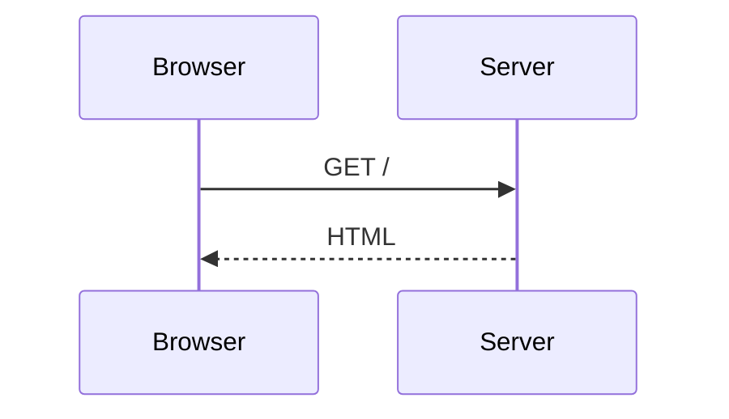

# SSG integration

<p class="lede">Write a <code>```mermaid</code> fence in MDX and get a diagram. <a href="/ssg/docs/getting-started">@sigx/ssg</a> needs no changes — <code>markdown.shiki.skipLanguages</code> was already the documented seam for exactly this.</p>

## Setup

```ts
// ssg.config.ts
import { defineSSGConfig } from '@sigx/ssg';
import { rehypeMermaid } from '@sigx/mermaid/ssg';

export default defineSSGConfig({
    markdown: {
        shiki: { skipLanguages: ['mermaid'] },
        rehypePlugins: [rehypeMermaid],
    },
    clientImports: ['@sigx/mermaid/styles', '@sigx/mermaid/client'],
});
```

Three pieces, and each is load-bearing:

1. **`skipLanguages: ['mermaid']`** leaves the raw `<pre><code class="language-mermaid">` in the output instead of syntax-highlighting it. Without this shiki gets there first and there is nothing left to claim.
2. **`rehypeMermaid`** claims those fences at build time and emits the `<figure>`.
3. **`clientImports`** adds the styles and the enhancer that renders them in the browser.

Then write a fence:

````mdx

````

`title` on the fence becomes the `<figcaption>`.

## `rehypeMermaid` options

Usable bare (`rehypePlugins: [rehypeMermaid]`) or configured (`rehypePlugins: [[rehypeMermaid, { language: 'mmd' }]]`).

| Option | Default | Description |
| --- | --- | --- |
| `language` | `'mermaid'` | The fence language this plugin claims. **Must also appear in `skipLanguages`.** |
| `className` | `'sigx-mermaid'` | Class on the emitted `<figure>`. |

## The client enhancer

Importing `@sigx/mermaid/client` installs it. For control over where and when it looks:

```ts
import { installMermaid } from '@sigx/mermaid/client';

installMermaid({ rootMargin: '400px' });
```

| Option | Default | Description |
| --- | --- | --- |
| `root` | the document | Where to look — for the initial scan **and** the observer that catches diagrams added later. Diagrams outside it are left alone. With the default, the observer narrows to `#app`, falling back to `<body>`. |
| `rootMargin` | `'200px'` | How far outside the viewport to start rendering. |

`installMermaid` is safe to call repeatedly — only the first call does anything — and returns a disposer. `uninstallMermaid()` tears down whatever is installed, whether it came from an explicit call or from importing the module.

**Failures degrade visibly.** A diagram that fails to parse leaves its source on the page with `data-mermaid-state="error"`, never a blank box.

## Contributing it from a theme

An `@sigx/ssg` theme can carry the integration so every site using it gets diagrams:

```ts
import { mermaidThemeContribution } from '@sigx/mermaid/ssg';

export const myTheme = {
    ...mermaidThemeContribution,
};
```

`applyThemeConfig` merges `markdown.rehypePlugins` and prepends the `css` entries to `clientImports`.

**The site still owns `skipLanguages`.** A theme cannot contribute it, because `ThemeConfig.markdown` only carries plugin arrays — so a site adopting such a theme adds that one line itself.

## Next steps

- [API reference](/mermaid/docs/api) — every export.
